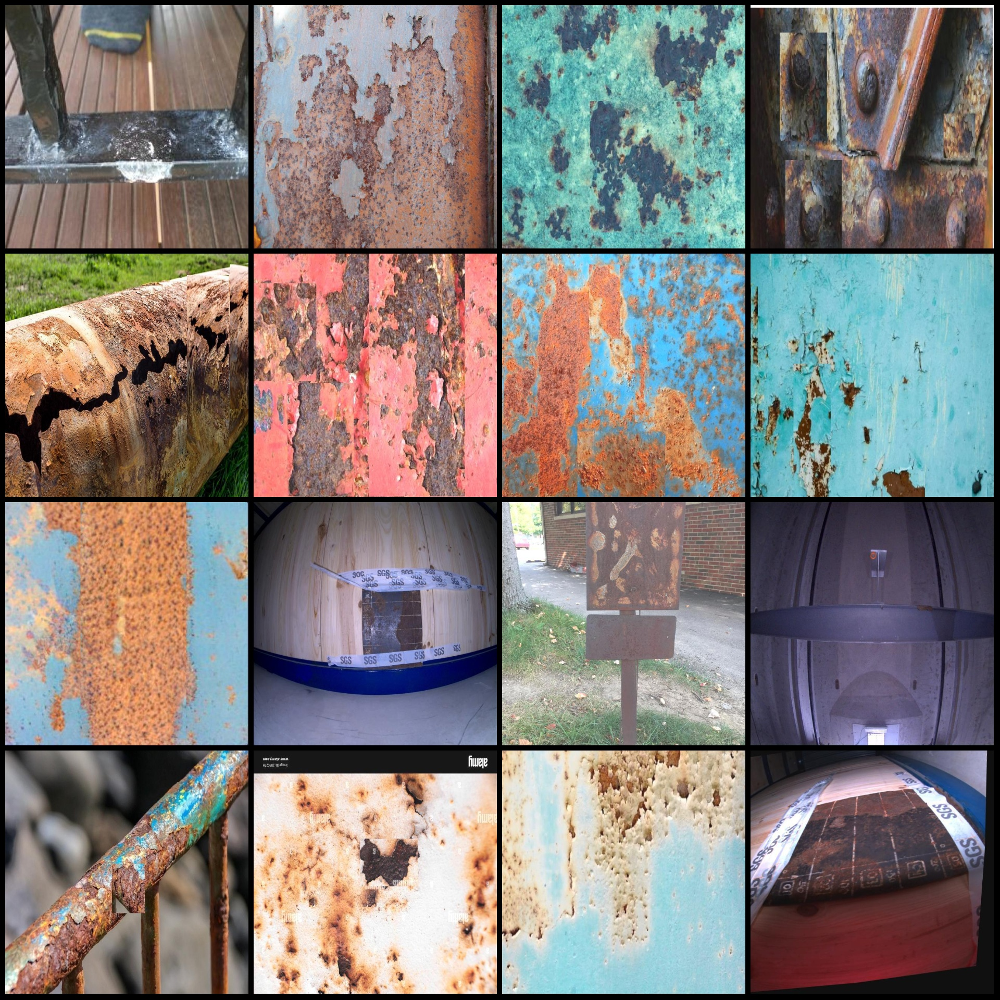
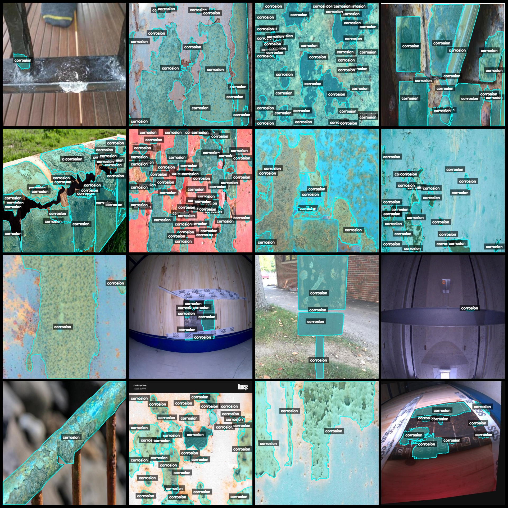
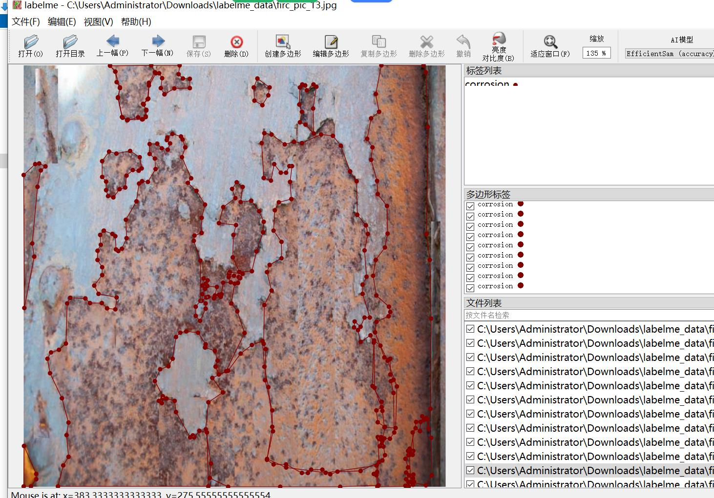

# Smart Industrial Metal Rust Identification and Segmentation Dataset - LabelMe Format with 2635 Categories

**Note:** The dataset contains a large number of image enhancements. Approximately 300 original images remain, while the rest are enhanced images.

**Dataset Format:** LabelMe format (excluding mask files; only include jpg images and corresponding json files)

**Image Counts:** 2635 JPG files
**Annotation Counts:** 2635 JSON files
**Number of Annotation Categories:** 1
**Annotation Category Name:** "corrosion"

**Box Counts per Category:**
- Corrosion count = 31064
- Total boxes = 31064

**Annotation Tool Usage:** labelme=5.5.0

**Image Resolution:** 640x640

**Annotation Rules:** Polygons are drawn around categories.

**Important Notes:** You can edit the dataset using LabelMe, but the JSON dataset needs to be converted into either Mask format, Yolo format, or COCO format for semantic segmentation or instance 
segmentation.

**Special Declaration:** This dataset does not guarantee the accuracy of the trained models or weight files.

**Image Preview:**

**Examples of Annotation:**
- **Original Images (select 16 randomly):**

**Annotation Drawing Results:**

**LabelMe Editing Example Image:**

## Images

Here is a pay link on Stripe ( https://buy.stripe.com/3cs8yP7sY87d0vu9AB ). Please contact me lonlonago@foxmail.com after funding $89, and I will send you a complete data files , thank you!

